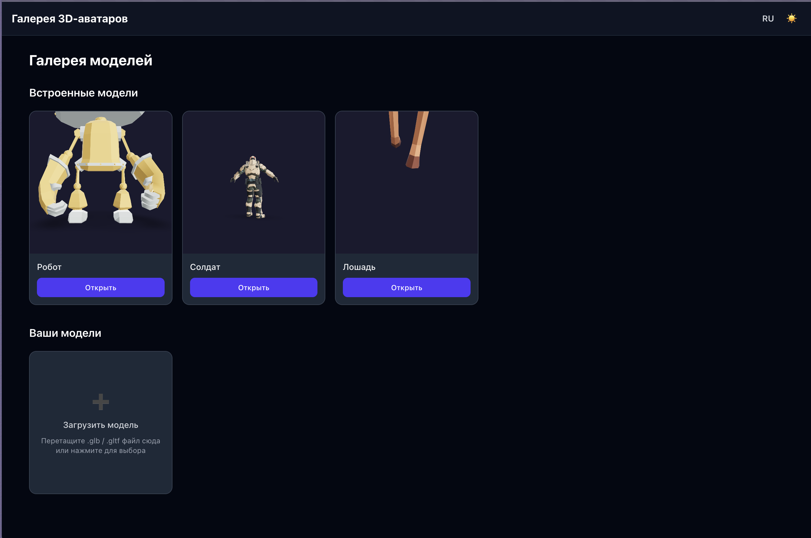

# Web-витрина 3D-аватаров

Одностраничное веб-приложение для просмотра, загрузки и настройки 3D-моделей персонажей в интерактивной сцене прямо в браузере.

---

## Список технологий

| Технология                 | Назначение                                            |
| -------------------------- | ----------------------------------------------------- |
| React                      | UI-библиотека, компонентный подход                    |
| TypeScript                 | Статическая типизация                                 |
| Vite                       | Сборщик и dev-сервер                                  |
| Tailwind CSS               | Utility-first стилизация                              |
| Three.js                   | 3D-рендеринг (WebGL)                                  |
| React Three Fiber          | React-обёртка над Three.js                            |
| React Three Drei           | Готовые 3D-хелперы (OrbitControls, Environment и др.) |
| React Three Postprocessing | Пост-эффекты (Bloom)                                  |
| Zustand                    | Управление состоянием                                 |
| React Router               | Клиентская маршрутизация                              |
| idb-keyval                 | Хранение пользовательских моделей в IndexedDB         |
| ESLint                     | Линтинг кода                                          |

Архитектура проекта построена по методологии **Feature-Sliced Design (FSD)**.

---

## Памятка по запуску

### Требования

- **Node.js** ≥ 18
- **npm** ≥ 9

### Установка и запуск

```bash
# 1. Клонировать репозиторий
git clone https://github.com/artishokq/WebGalleryOf3dAvatars
cd WebGalleryOf3dAvatars/app

# 2. Установить зависимости
npm install

# 3. Запустить dev-сервер
npm run dev
```

Приложение будет доступно по адресу **http://localhost:5173**.

### Другие команды

| Команда           | Описание                                    |
| ----------------- | ------------------------------------------- |
| `npm run build`   | Сборка продакшен-версии (TypeScript + Vite) |
| `npm run preview` | Превью собранной версии                     |
| `npm run lint`    | Проверка кода линтером ESLint               |

---

## Структура проекта (FSD)

```
src/
├── app/            — точка входа, провайдеры, роутер
├── pages/          — страницы (Gallery, Editor)
├── widgets/        — составные блоки UI (SceneViewer, ControlPanel, Header и др.)
├── features/       — пользовательские сценарии (загрузка модели, смена скина, скриншот и др.)
├── entities/       — бизнес-сущности (Avatar, ModelCard)
└── shared/         — общие утилиты, UI-компоненты, i18n, тема, типы, конфиг
```

---

## Скриншот стартовой страницы


